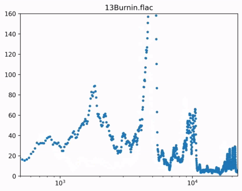

```{r setup, include = FALSE}
knitr::opts_chunk$set(echo = TRUE)
```


## Outline

- Example workflow description
- Job Arrays (low overhead)
- SnakeMake  (readability prioritized)
- Pegasus    (portability prioritized)
- Makeflow   (simplicity prioritized)
- Questions
- Lab/Project time

## Getting setup
- Slides are available at https://github.com/uschpc/workshop-workflows
- `git clone https://github.com/uschpc/workshop-workflows.git`
- Open `index.html` in browser
- examples in `examples`

## Why are we here?!
<div class="columns-2" >


[Alnitak and the Flame Nebula](https://astroaro.fr/en/en_neb-de-la-flamme/)
```{r,echo=FALSE,out.width="75%"}

```

- Researchers often spend time submitting jobs, checking on jobs
- When jobs complete, they decided if they want to submit more jobs
- This is time consumuing, tedious, can be error prone
- Anything repetitive can be *automated*


</div>
## What is 'Workflow Management Software'?

- Workflows are sets of tasks that depend on each other
- Workflow Management Software (WMS)
    - Tracks how jobs relate to each other
    - Tracks output files
    - Submits jobs for you
    - Resubmits if needed
    - Deletes intermediate files (if you don't need them)

## Example workflow: Music Visualizer
<div class="columns-2">
- R.I.P Daft Punk!
    - Kind of old news
- We will make them a fitting tribute
- I want to run a music visualization program
    - Song broken up into pieces
    - Each pieces represented as an image
    - Merge each piece into a movie
    - Do this for **every** song on **every** album

```{r,echo=FALSE,out.width="75%"}

```
</div>

## Example workflow: Input data

<div class="columns-2">
- For this tutorial, we'll use music with permissive licensing :)
- [Symphonie fantastiqe - Hector Berlioz](https://en.wikipedia.org/wiki/Symphonie_fantastique)
- Downloadable here https://www.liberliber.it/online/autori/autori-b/hector-berlioz/symphonie-fantastique-op-14-concertgebouw-orchestra-of-amsterdam/
- Cleaned up filenames available here:
    - https://app.globus.org/file-manager?origin_id=5eebdcc6-9760-458a-a963-456d0590f311&origin_path=%2F (download to your project with Globus)
   - `-wget --no-check-certificate https://g-3d96ec.a78b8.36fe.data.globus.org/symphonie_fantastique.tar` (download tar file)
- Once you have `symphonie_fantastique.tar`, you can extract with `tar xfv symphonie_fantastique.tar`
    - Ideally put it in `data` directory

```{r,echo=FALSE,out.width="50%"}

```

</div>


## Example workflow: Music Visualizer

<div class="columns-2">

```{r,echo=FALSE,out.width="100%"}

```

- There are 2 kinds of jobs
- "image generator"
    - Takes `input.flac` song file as input
    - Song is divided in into timed segments
    - Each segment is represted as series of images
    - 1 picture for every 1/60th of a second
    - Can run in any order
- `ffmpeg`
    - Merges all image files and `input.flac`
    - creates `output.mp4`
    - Can not run until **all** images are created
</div>

## Example workflow: Music Visualizer

- When complete, output files should be available under `output`
```{r,echo=FALSE,out.width="50%"}

```
- We should find
    - `output/<song_name>/<song_name>.mp4`
    - `output/<song_name>/images/*.png`

## Job type:`rosa_fft.py`

- "image generator" is a python script, `rosa_fft.py`
    -  `python3 rosa_fft.py -f 09Teachers.flac -i 172 -d 4 -o 09Teachers`

|option| meaning|
|---|---|
|-f | which song file to read from (doesn't have to be .flac format)|
|-i |initial time to start reading data|
|-d | how many seconds of song to read (default is 1)|
|-o | which directory to save images|


## Job type:`ffmpeg`
- ffmpeg is used to create movie file
    - `ffmpeg -threads 8 -framerate 60 -i 16Funk_Ad/images/frame%09d.png -i 16Funk_Ad.flac -pix_fmt yuv420p 16Funk_Ad.mp4`

|option| meaning|
|---|---|
|-threads| How many cpus to use when converting fiels|
|-framerate |How many pictures per second|
|-i | name or name pattern for input file(s) |
| -pix_fmt yuv420p | video encoding option?|
| output_file.mp4 | output file name|

## Job Arrays

- Built-in Slurm feature https://slurm.schedmd.com/job_array.html
- Use same job script for multiple jobs

rosa_fft_array.slurm:
```{r,engine='bash',eval=FALSE}
#!/bin/bash
#SBATCH --ntasks=1
#SBATCH --mem-per-cpu-1GB
#SBATCH --time=00:10:00
#SBATCH --array=0-9
module load python ffmpeg

# How many seconds to process per job
duration=4
time_index=$((SLURM_ARRAY_TASK_ID*duration))
song_file="data/symphonie_fantastique/berlioz_symphonie_2_un_bal_vals.mp3"
out_dir="output/berlioz_symphonie_2_un_bal_vals"

echo "Processing time_index:${time_index}"

python3 ./scripts/rosa_fft.py -f ${song_file} \
-i ${time_index} -t ${duration} -o ${out_dir}
```
- `$SLURM_ARRAY_TASK_ID` will be any number from 0-9

## Job Arrays
- Job script can be found in `examples/job_array`
- The important part is
```{r,engine='bash',eval=FALSE}
python3 ./scripts/rosa_fft.py -f ${song_file} \
-i ${time_index} -t ${duration} -o ${out_dir}
```

|Variable| meaning| value|
|---|---|---|
|`${song_file}`| Song file to process| `data/symphonie_fantastique/berlioz_symphonie_2_un_bal_vals.mp3`|
|`$SLURM_ARRAY_TASK_ID`| Which array element are we?| 0-9|
|`${duration}`|How many seconds to process?|4|
|`${time_index}`| Time to start processing| `$((SLURM_ARRAY_TASK_ID*duration))`| |
|`${out_dir}`| Where to save output data|`output/berlioz_symphonie_2_un_bal_vals`|
## Job Arrays

- Merge results with second job script
- `examples/job_array/ffmpeg.slurm`

ffmpeg.slurm:
```{r,engine='bash',eval=FALSE}
#!/bin/bash
#!/bin/bash
#SBATCH --ntasks=1
#SBATCH --cpus-per-task=4
#SBATCH --mem-per-cpu=1GB
#SBATCH --time=00:10:00
module load ffmpeg

song_file="data/symphonie_fantastique/berlioz_symphonie_2_un_bal_vals.mp3"
frame_dir="output/berlioz_symphonie_2_un_bal_vals/images"
out_file="output/berlioz_symphonie_2_un_bal_vals.mp4"

ffmpeg \
-framerate 60 -i ${frame_dir}/frame%09d.png \
-i ${song_file} \
-pix_fmt yuv420p \
-threads ${SLURM_CPUS_PER_TASK} \
${out_file}
```


## Job dependencies
- This job cannot run until every element of `rosa_fft_array.slurm` completes.
- Instead of waiting, we can set a **job dependency**
- We set jobs to wait until others complete before running
- Using `bash` we can capture the job id
    - When submitting job, Slurm returns `Submitted batch job XXXXX`
    - We can use `cut` to parse text

`examples/job_array/manager.sh`:

```{r,engine='bash',eval=FALSE}
#!/bin/bash

# save 4th word using ' ' as delmiter
# AKA the job id
jid=$(sbatch examples/job_array/job_array.slurm | cut -d ' ' -f 4)

sbatch --dependency=afterok:${jid} examples/job_array/ffmpeg.slurm
```


## Job array remarks

- Some basic features of a workflow manager
    - Some tasks are independent
    - Some have dependencies
    - "Template" tasks
- Easy to get set up for simple cases
- Can get out of hand quickly
- No method to handle errors
    - What if only some tasks fail?
- Large arrays can put load on scheduler    

## Workflow managers

- WMS have syntax to describe the workflow
- Usually task
    - input
    - output
    - command to generate output file
- Optional:
    - Rules if task fails
    - Compute resources for task
    - How many tasks to run in parallel
- Task order is tracked by input/output files

## SnakeMake
- A future version of this presentation will have more info on [SnakeMake](https://snakemake.readthedocs.io/en/stable/tutorial/short.html)
- Python based
- Includes features for tracking software dependencies
- Prioritizes readability
- Syntax is kind of obtuse

```{r,engine='bash',eval=FALSE}
rule bwa:
    input:
        "data/genome.fa",
        "data/samples/{sample}.fastq"
    output:
        temp("mapped/{sample}.bam")
    conda:
        "envs/mapping.yaml"
    threads: 8
    shell:
        "bwa mem -t {threads} {input} | samtools view -Sb - > {output}"
```
##  Parts of pegasus workflow
- workflow generator
- catalogs
    - transformation.yml
        - Where are executables?
    - sites.yml
        - Details on execution site
    - replicas.yml
        - Where are files saved?
- workflow.yml
    - List of every job
    - input files
    - output files
    - executable
    - arguments
    - dependent jobs

## Makeflow

- We will use [Makeflow](http://ccl.cse.nd.edu/software/makeflow/) as an example
- The choice is kind of arbitrary
    - In general choose something that you are comfortable with
    - Something that has large userbase incase you need support

## Makeflow file

- Makeflow can be used similar to `MakeFile` used in building software
- Format is:
```{r,engine='bash',eval=FALSE}
outputfile(s): inputfile(s)
# Leading whitespace below must be tab character, not spaces!
        command to generate outputfile(s)
```
## Makeflow file
- From the Makeflow Tutorial

```{r,engine='bash',eval=FALSE}
CURL=/usr/bin/curl
CONVERT=/usr/bin/convert
URL="http://ccl.cse.nd.edu/images/capitol.jpg"

capitol.anim.gif: capitol.jpg capitol.90.jpg capitol.180.jpg capitol.270.jpg capitol.360.jpg
    LOCAL $(CONVERT) -delay 10 -loop 0 capitol.jpg capitol.90.jpg capitol.180.jpg capitol.270.jpg capitol.360.jpg capitol.270.jpg capitol.180.jpg capitol.90.jpg capitol.anim.gif

capitol.90.jpg: capitol.jpg
    $(CONVERT) -swirl 90 capitol.jpg capitol.90.jpg

capitol.180.jpg: capitol.jpg
    $(CONVERT) -swirl 180 capitol.jpg capitol.180.jpg

capitol.270.jpg: capitol.jpg
    $(CONVERT) -swirl 270 capitol.jpg capitol.270.jpg

capitol.360.jpg: capitol.jpg
    $(CONVERT) -swirl 360 capitol.jpg capitol.360.jpg

capitol.jpg:
    LOCAL $(CURL) -o capitol.jpg $(URL)
```

## Makeflow file
- Here's a snippet of a Makeflow file:
```{r,engine='bash',eval=FALSE}

./berlioz_symphonie_1_reveries_pa/berlioz_symphonie_1_reveries_pa.mp4: ./berlioz_symphonie_1_reveries_pa/images/frame000000000.png ./berlioz_symphonie_1_reveries_pa/images/frame000000001.png ./berlioz_symphonie_1_reveries_pa/images/frame000000002.png ./berlioz_symphonie_1_reveries_pa/images/frame000000003.png ./berlioz_symphonie_1_reveries_pa/images/frame000000004.png ./berlioz_symphonie_1_reveries_pa/images/frame000000005.png ./berlioz_symphonie_1_reveries_pa/images/frame000000006.png ./berlioz_symphonie_1_reveries_pa/images/frame000000007.png ./berlioz_symphonie_1_reveries_pa/images/frame000000008.png ./berlioz_symphonie_1_reveries_pa/images/frame000000009.png ./berlioz_symphonie_1_reveries_pa/images/frame000000010.png ./berlioz_symphonie_1_reveries_pa/images/frame000000011.png ./berlioz_symphonie_1_reveries_pa/images/frame000000012.png ./berlioz_symphonie_1_reveries_pa/images/frame000000013.png ./berlioz_symphonie_1_reveries_pa/images/frame000000014.png ./berlioz_symphonie_1_reveries_pa/images/frame000000015.png
    fmpeg -threads 4 -framerate 60 -i Homework/04Da_Funk/images/frame%09d.png -i data/Homework/04Da_Funk.flac -pix_fmt yuv420p  Homework/04Da_Funk/04Da_Funk.mp4

./berlioz_symphonie_1_reveries_pa/images/frame000000000.png ./berlioz_symphonie_1_reveries_pa/images/frame000000001.png ./berlioz_symphonie_1_reveries_pa/images/frame000000002.png ./berlioz_symphonie_1_reveries_pa/images/frame000000003.png ./berlioz_symphonie_1_reveries_pa/images/frame000000004.png ./berlioz_symphonie_1_reveries_pa/images/frame000000005.png ./berlioz_symphonie_1_reveries_pa/images/frame000000006.png ./berlioz_symphonie_1_reveries_pa/images/frame000000007.png ./berlioz_symphonie_1_reveries_pa/images/frame000000008.png ./berlioz_symphonie_1_reveries_pa/images/frame000000009.png ./berlioz_symphonie_1_reveries_pa/images/frame000000010.png ./berlioz_symphonie_1_reveries_pa/images/frame000000011.png ./berlioz_symphonie_1_reveries_pa/images/frame000000012.png ./berlioz_symphonie_1_reveries_pa/images/frame000000013.png
    python3 /scripts/rosa_fft.py -f /project/hpcroot/csul/workshop-workflows/data/symphonie_fantastique/berlioz_symphonie_1_reveries_pa.mp3  -i 1 -o ./berlioz_symphonie_1_reveries_pa
```

- A few remarks
    - For more than a few files, Makeflow file is hard to read
    - Can be tedious to write by hand

## Makeflow file
- Due to a "quirk" in Makeflow we must add intermediate step

```{r,engine='bash',eval=FALSE}
output/song_name/index_XXXX_complete: list of .png files
    touch output/song_name/index_XXXX_complete
```
- Makeflow breaks if rules are too long
- This step says that if all images for time index XXXX exist, that rule is complete

- The ffmpeg step then uses the rule

```{r,engine='bash',eval=FALSE}
output/song_name/song_name.mp4 : (list of output/song_name/index_XXXX_complete files)
    ffmpeg ....
```
- If all `index_XXXX_complete` files exist, most likely all frames exist

## Makeflow JX
- Makeflow also supports **J**SON e**X**tended syntax
- Much more readable but personally I couldn't get it to work

```{
"rules":[
         {
            "outputs":["input.txt"],
            "command":"echo \"Hello Makeflow!\" > input.txt",
            "local_job":true,
         },
         {
            "outputs":[format("output.%d",i)],
            "inputs":["simulation.py","input.txt"],
            "command":format("./simulation.py %d < input.txt > output.%d", i, i),
         } for i in range(1,5)
        ],
}
```
## Running a Makeflow
- Assume we have a Makeflow file that converts a song
- How do we use it?
- For small number of jobs we can run locally
- You'll have to put your own songs under data
example 1
2 seconds of video

- Let's run in interactive session
- `salloc --ntasks=1 --cpus-per-task=8 --time=1:00:00 --mem-per-cpu=2GB`
- Generate makeflow file (first two seconds of song)
- `python3 examples/two_seconds/generate_makefile_params.py -f data/Homework/01Daftendirekt.flac -o examples/two_seconds/`


## Running a Makeflow
- Run the makeflow
```{r,engine='bash',eval=FALSE}

makeflow berlioz_symphonie_1_reveries_pa.makeflow                                        
parsing berlioz_symphonie_1_reveries_pa.makeflow...                                                                     
local resources: 24 cores, 193123 MB memory, 5192904429 MB disk
max running local jobs: 24                                  
checking berlioz_symphonie_1_reveries_pa.makeflow for consistency...
berlioz_symphonie_1_reveries_pa.makeflow has 3 rules.
creating new log file berlioz_symphonie_1_reveries_pa.makeflow.makeflowlog...
checking files for unexpected changes...  (use --skip-file-check to skip this step)
starting workflow....
submitting job: python3 /project/hpcroot/csul/workshop-workflows/scripts/rosa_fft.py -f /project/hpcroot/csul/workshop-w
orkflows/data/symphonie_fantastique/berlioz_symphonie_1_reveries_pa.mp3 -i 1 -o ./berlioz_symphonie_1_reveries_pa
submitted job 32066
submitting job: python3 /project/hpcroot/csul/workshop-workflows/scripts/rosa_fft.py -f /project/hpcroot/csul/workshop-w
orkflows/data/symphonie_fantastique/berlioz_symphonie_1_reveries_pa.mp3 -i 0 -o ./berlioz_symphonie_1_reveries_pa
submitted job 32067
job 32066 completed  
job 32067 completed  

submitting job: ffmpeg -threads 4 -framerate 60 -i ./berlioz_symphonie_1_reveries_pa/images/frame%09d.png -i /project/hp
croot/csul/workshop-workflows/data/symphonie_fantastique/berlioz_symphonie_1_reveries_pa.mp3 -pix_fmt yuv420p ./berlioz_
symphonie_1_reveries_pa/berlioz_symphonie_1_reveries_pa.mp4                                                             
submitted job 32185                                          
job 32185 completed
nothing left to do.
```


## Running a Makeflow

- Output files should be available under `examples/makeflow/`
```{r,echo=FALSE,out.width="50%"}

```
- We should find
    - `<song_name>.mp4`
    - `images/*.png`

## Cleaning up
- The `images` directory contains intermediate files
- Not needed after final product is complete
- Clean with `makeflow --clean=intermediates examples/two_seconds/makeflows/01Daftendirekt.makeflow`

```
makeflow --clean=intermediates berlioz_symphonie_1_reveries_pa.makeflow
parsing berlioz_symphonie_1_reveries_pa.makeflow...                                                                     
local resources: 24 cores, 193123 MB memory, 5192805270 MB disk    
max running local jobs: 24                                                                                              
checking berlioz_symphonie_1_reveries_pa.makeflow for consistency...
berlioz_symphonie_1_reveries_pa.makeflow has 3 rules.                                                                   
recovering from log file berlioz_symphonie_1_reveries_pa.makeflow.makeflowlog...
checking for old running or failed jobs...
checking files for unexpected changes...  (use --skip-file-check to skip this step)
cleaning filesystem...

deleted ./berlioz_symphonie_1_reveries_pa/images/frame000000045.png
deleted ./berlioz_symphonie_1_reveries_pa/images/frame000000041.png
deleted ./berlioz_symphonie_1_reveries_pa/images/frame000000115.png
deleted ./berlioz_symphonie_1_reveries_pa/images/frame000000078.png
deleted ./berlioz_symphonie_1_reveries_pa/images/frame000000083.png
deleted ./berlioz_symphonie_1_reveries_pa/images/frame000000068.png
deleted ./berlioz_symphonie_1_reveries_pa/images/frame000000056.png
deleted ./berlioz_symphonie_1_reveries_pa/images/frame000000072.png
```

## Questions?

## Labs/Projects
- Create a set of job arrays that will process first 10s of each song
- Makeflow
    - Write a python script that will generate a makeflow to process an entire song
    - Given a makeflow file with many tasks, try to run on multiple nodes

## Project 1 Job array
- Create a set of job arrays that will process first 10s of each song
- Comes with `projects/project1/job_array.slurm_template`
```{r,engine='bash',eval=FALSE}
#!/bin/bash
#SBATCH --ntasks=1
#SBATCH --mem-per-cpu-1GB
#SBATCH --time=00:10:00
#SBATCH --array=0-9
module load python ffmpeg libsndfile

# How many seconds to process per job
duration=4
time_index=$((SLURM_ARRAY_TASK_ID*duration))
song_file="XXX.mp3"
out_dir="output/XXX"

echo "Processing time_index:${time_index}"

python3 ./scripts/rosa_fft.py -f ${song_file} -i ${time_index} -t ${duration} -o ${out_dir}
```
- Hint: `sed 's/XXX/cool_song/g' job_array.slurm_template` will find every `XXX` and replace with `cool_song`
- Use files in `examples/job_array` as needed

## Project 2 Generate a Makeflow
- Write a python script that will generate a makeflow to process an entire song
- You can find a script to get started in `projects/project2/generate_makefile.py`
- Run it to get an idea of the format
- It contains 3 "jobs"
- They don't do anything but it does demonstrate the format
- My solution (no peeking!) ~~is there~~ was there but got overwritten on accident :(
    - I've been using it to generate makeflow files for this presentation

## Project 3 Run a large Makeflow
- What if we have many tasks we want to run?
    -   Considering most songs are at least a few minutes long (100s of 'jobs')
- We can spread the work out over multiple compute nodes
- We need to run 2 kinds of processes
- Daemon (background process)
    - Reads the Makeflow file assigns work
- Worker process
    - Looks for Daemon and requests work

## Projec 3 Running a large Makeflow
- The first song in our collection is ~12 minutes long (over 1440 jobs)
- To launch daemon `makeflow -T wq projects/project3/berlioz_symphonie_1_reveries_pa.makeflow -p $PORT`
- `export PORT=8888`
- This sets up a job manager that "listens" for workers on port `$PORT`
```
parsing makeflows/Blitz_it.makeflow...
local resources: 20 cores, 64334 MB memory, 5566556492 MB disk
max running remote jobs: 1000
max running local jobs: 20
checking makeflows/Blitz_it.makeflow for consistency...
makeflows/Blitz_it.makeflow has 72 rules.
submitted job 43
submitting job: python3 ./scripts/rosa_fft.py -f data/chirpy/Blitz_it.wav -i 27 -o ./Blitz_it
submitted job 44
submitting job: python3 ./scripts/rosa_fft.py -f data/chirpy/Blitz_it.wav -i 26 -o ./Blitz_it
submitted job 45
submitting job: python3 ./scripts/rosa_fft.py -f data/chirpy/Blitz_it.wav -i 25 -o ./Blitz_it
submitted job 46
submitting job: python3 ./scripts/rosa_fft.py -f data/chirpy/Blitz_it.wav -i 24 -o ./Blitz_it
submitted job 47
submitting job: python3 ./scripts/rosa_fft.py -f data/chirpy/Blitz_it.wav -i 23 -o ./Blitz_it
submitted job 48
submitting job: python3 ./scripts/rosa_fft.py -f data/chirpy/Blitz_it.wav -i 22 -o ./Blitz_it
submitted job 49
submitting job: python3 ./scripts/rosa_fft.py -f data/chirpy/Blitz_it.wav -i 21 -o ./Blitz_it
submitted job 50
submitting job: python3 ./scripts/rosa_fft.py -f data/chirpy/Blitz_it.wav -i 20 -o ./Blitz_it
```

## Running a large Makeflow
- To launch workers `srun work_queue_worker $HOSTNAME:$PORT projects/project3/berlioz_symphonie_1_reveries_pa.makeflow`
- This sets up
- `$HOSTNAME` must be the hostname where the job manager process is running
- `$PORT` must be same port that manager is listening for
- You can potentially complete this workflow in about same amount of time as song runtime
    - Requires 100s of CPUs
```
work_queue_worker: creating workspace /scratch/csul/makeflow/example/worker-268648-412
work_queue_worker: creating workspace /scratch/csul/makeflow/example/worker-268648-416
work_queue_worker: creating workspace /scratch/csul/makeflow/example/worker-268648-406
work_queue_worker: creating workspace /scratch/csul/makeflow/example/worker-268648-404
work_queue_worker: using 24 cores, 193123 MB memory, 185757288 MB disk, 0 gpus
connected to manager d06-15.hpc.usc.edu:8080 via local address 10.125.19.236:57664
work_queue_worker: using 24 cores, 193123 MB memory, 185757288 MB disk, 0 gpus
connected to manager d06-15.hpc.usc.edu:8080 via local address 10.125.19.236:57668
work_queue_worker: using 24 cores, 193123 MB memory, 185757288 MB disk, 0 gpus
connected to manager d06-15.hpc.usc.edu:8080 via local address 10.125.19.236:57672
work_queue_worker: using 24 cores, 193123 MB memory, 185757284 MB disk, 0 gpus
connected to manager d06-15.hpc.usc.edu:8080 via local address 10.125.19.234:59316
```
